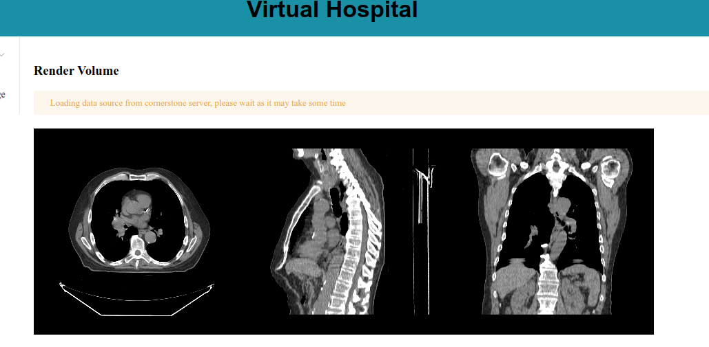
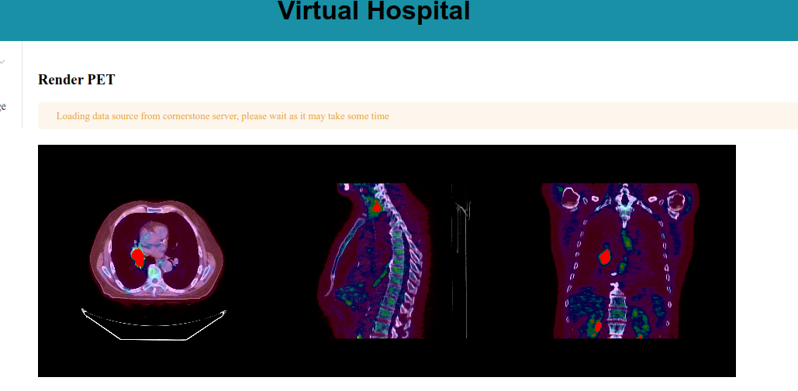
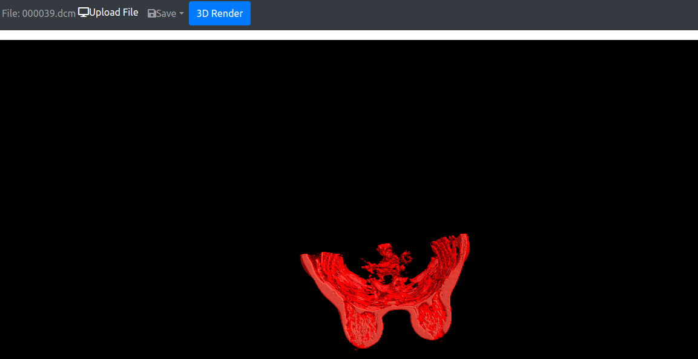

# virtual-hospital

## Description
This is a virtual hospital where students can study and learn about some anatomy concepts.

## Installation
### Requirements
- Node.js
- yarn

### Steps
1. Clone the repository

#### 2D Virtual Hospital
2. Go to the 2d-virtual-hospital folder `cd 2d`
3. Run `yarn install`
4. Run `yarn serve`

#### 3D Virtual Hospital
2. Go to the 3d-virtual-hospital folder `cd 3d`
3. Run `yarn install`
4. Run `yarn serve`

## Images

