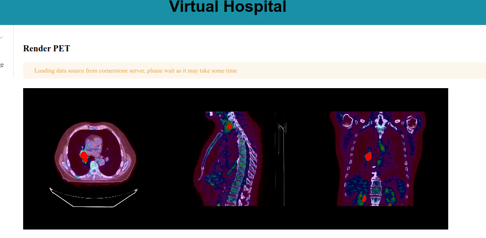

# virtual-hospital

## Description
This is a virtual hospital where students can study and learn about some anatomy concepts.

## Installation
### Requirements
- Node.js
- yarn

### Steps
1. Clone the repository
2. Run `yarn install`
3. Run `yarn serve`

## Images

